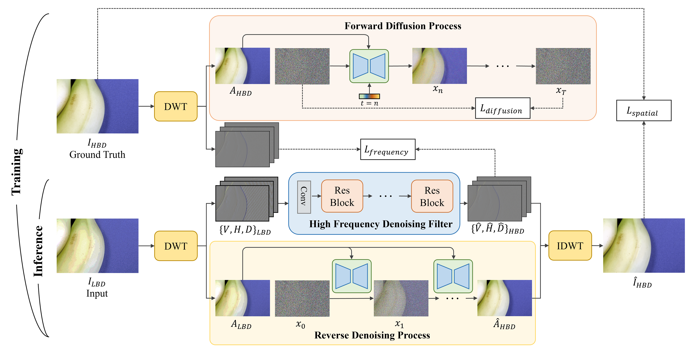

# [MMSP'24] Bit_Depth_Expansion (Diffusion)
Official Pytorch implementation of **Diffusion-based Bit-depth Expansion**.

[Riyu Lu](),
[Lingyu Zhu](https://scholar.google.com/citations?user=IhyTEDkAAAAJ&hl=zh-CN),
[Baoliang Chen](https://scholar.google.com/citations?user=w_WL27oAAAAJ&hl=zh-CN),
[Xiaopeng Fan](https://scholar.google.com/citations?user=4LsZhDgAAAAJ&hl=zh-CN),
[Shiqi Wang](https://scholar.google.com/citations?user=Pr7s2VUAAAAJ&hl=zh-CN)


[[`Arxiv`]()] [[`Poster`]()] [[`Presentation`](src/figures/Presentation.pdf)]

## Overview
<p align="left">

</p>

Diffusion-based generative models have achieved remarkable success across a variety of applications. However, the potential application for bit-depth expansion has not been extensively studied. This paper introduces a wavelet-based diffusion model for the bit-depth expansion task. In this method, the image is first decomposed into low and high-frequency components via wavelet transformation. This decomposition allows for targeted processing by specialized modules and reduces computational complexity by lowering the image resolution. The low-frequency component is processed in both the forward diffusion and reverse denoising stages. Meanwhile, the high-frequency components are
filtered by the High Frequency Denoising Filter (HFDF) to eliminate noise and artifacts. Finally, the low and high-frequency components are recombined into a predicted high-bit-depth image through inverse wavelet transformation. Experimental results demonstrate the superiority of the proposed method in producing perceptually compelling outputs that outperform previous methods.

## Qualitative Performance
<p align="left">

</p>


## TODO List
This repository is still under active construction:
- [ ] Release training and testing codes
- [ ] Release pretrained models
- [ ] Clean the code


## Contact

- Lingyu Zhu: lingyzhu-c@my.cityu.edu.hk
- Riyu Lu: riyulu2-c@my.cityu.edu.hk

## Citation

If you find our work helpful, please consider citing:

```bibtex

```
